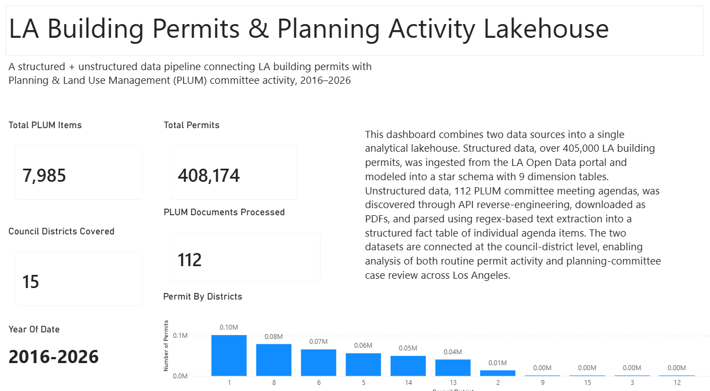
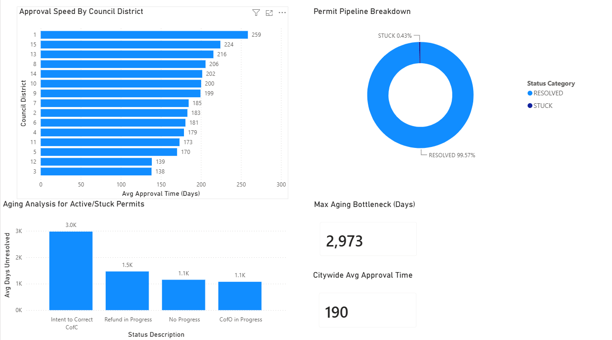
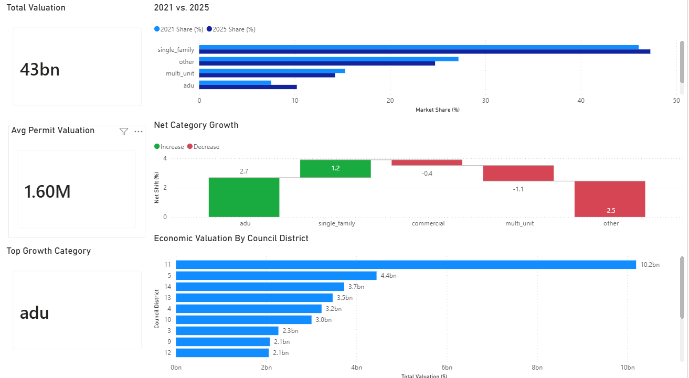
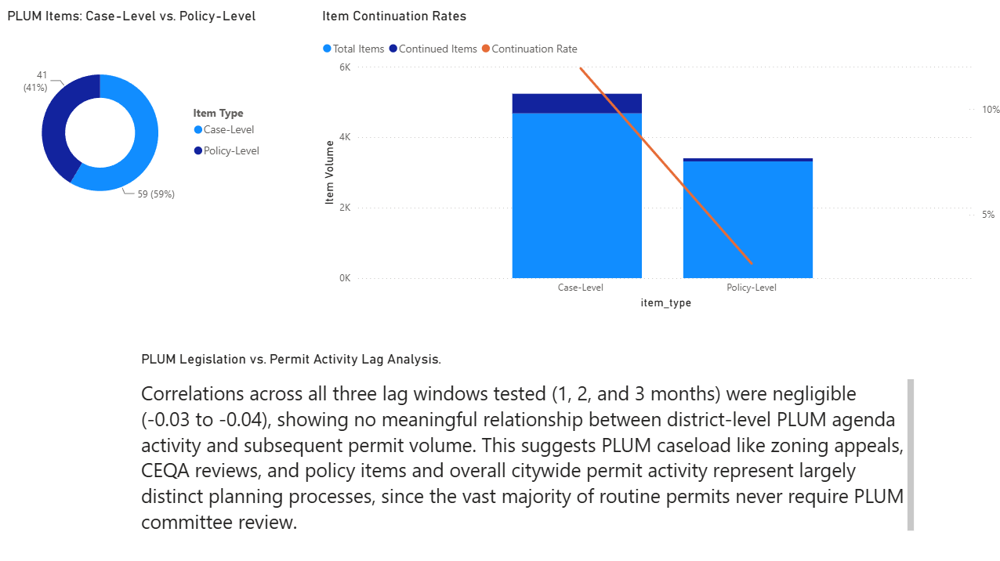
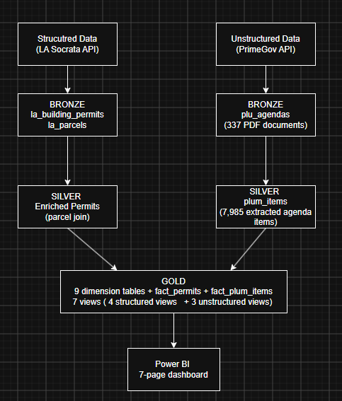

# The-Azure-Building-Permits-Lakehouse-project
# LA Building Permits & Planning Activity Lakehouse

A structured + unstructured municipal data pipeline analyzing **408K+ Los Angeles building permits** alongside **Planning & Land Use Management (PLUM) committee activity** across all 15 Los Angeles City Council districts.

The project combines API-based structured data with PDF-based unstructured data, transforms both into analytical tables using a **Bronze → Silver → Gold lakehouse architecture**, and delivers the resulting analysis through an interactive **Power BI dashboard**.

The primary goal is to answer practical analytical questions around **permit processing, operational bottlenecks, development activity, and planning-committee activity**.

---

## Table of Contents

* [Project Overview](#project-overview)
* [Business Questions](#business-questions)
* [Key Findings](#key-findings)
* [Dashboard](#dashboard)
* [Data](#data)
* [Analytical Approach](#analytical-approach)
* [Architecture](#architecture)
* [Technical Challenges & Solutions](#technical-challenges--solutions)
* [Pipeline Orchestration](#pipeline-orchestration)
* [Tech Stack](#tech-stack)
* [Project Structure](#project-structure)
* [How to Run](#how-to-run)
* [What This Project Demonstrates](#what-this-project-demonstrates)

---

## Project Overview

Municipal data is often distributed across different systems and formats.

Building permits are available as structured records through the LA Open Data portal, while Planning & Land Use Management (PLUM) committee activity is published through meeting documents containing semi-structured information inside PDF files.

This project brings those sources together into a single analytical environment.

### Dataset Scale

| Metric                         |          Value |
| ------------------------------ | -------------: |
| Building permits               |    **408,174** |
| PLUM agenda items              |      **8,003** |
| PLUM documents processed       |        **113** |
| Council districts              |         **15** |
| Analysis period                |  **2016–2026** |
| Citywide average approval time |   **190 days** |
| Resolved permits               |     **99.57%** |
| Stuck permits                  |      **0.43%** |
| Maximum unresolved aging       | **2,980 days** |

The resulting lakehouse supports analysis at the **permit, geographic, land-use, and PLUM agenda-item levels**.

---

## Business Questions

Rather than treating the project as an ETL exercise, the analysis focuses on questions that could be relevant to city operations and development activity.

### Permit Operations

* How long do permits take to reach resolution?
* How does average approval time vary between council districts?
* Which permit statuses represent the largest aging bottlenecks?
* How large is the unresolved permit population?
* Are there permits that have remained unresolved for unusually long periods?

### Development & Economic Activity

* How has the composition of permitted development changed over time?
* Which land-use categories are gaining or losing share?
* How does permit valuation vary across council districts?
* Which districts account for the largest share of reported development valuation?

### Planning Committee Activity

* What types of matters are reviewed by the PLUM committee?
* How frequently are case-level items continued?
* How does case-level activity compare with policy-level activity?
* Is there an observable short-term relationship between PLUM activity and subsequent permit volume?

---

# Key Findings

The dashboard surfaces several notable patterns in the underlying data.

## 1. Permit processing time varies substantially by district

Average approval time ranges from:

* **138 days — District 3**
* **259 days — District 1**

That's a **121-day difference** between the fastest and slowest districts.

The citywide average approval time is approximately **190 days**.

This provides a clear operational comparison between districts rather than looking only at citywide averages.

---

## 2. Most permits resolve normally, but the unresolved population contains extreme aging

The permit pipeline is heavily concentrated in the resolved category:

* **99.57% — Resolved**
* **0.43% — Stuck**

Although the stuck population represents a small percentage of total permits, the aging analysis reveals several long-running cases.

The maximum observed aging is approximately **2,980 days**.

The largest aging categories include statuses such as:

* `Intent to Correct CofC`
* `Refund in Progress`
* `No Progress`
* `CofO in Progress`

This demonstrates why analyzing only the percentage of unresolved records can hide operational problems within the tail of the distribution.

---

## 3. Development activity differs across council districts

Permit volume is not evenly distributed across Los Angeles.

The dashboard compares permit counts across all 15 council districts, providing a geographic view of where building activity is concentrated.

This allows permit activity to be analyzed alongside:

* Land-use categories
* Permit valuation
* Processing time
* PLUM activity

rather than treating each metric independently.

---

## 4. Land-use composition has shifted over time

The project compares land-use category shares across different periods to identify changes in the composition of permitted development.

One notable finding is the increase in **Accessory Dwelling Unit (ADU)** activity, which shows the largest positive share shift among the analyzed categories between 2021 and 2025.

The analysis focuses on changes in observed permit composition rather than assuming a specific causal explanation.

---

## 5. PLUM activity can be separated into case-level and policy-level work

PLUM agenda items were classified into two broad analytical categories:

* **Case-level matters:** zoning, CEQA, and development-related review
* **Policy-level matters:** procedural, ordinance, and broader policy activity

The resulting classification makes it possible to compare continuation behavior and meeting activity across the two types of work.

Case-level items were continued substantially more often than policy-level items in the analyzed data.

---

## 6. PLUM activity showed little short-term correlation with permit volume

The project tests whether PLUM agenda activity is associated with building permit volume in the following **1-, 2-, and 3-month windows**.

The observed correlations were close to zero across the tested lags.

This suggests that **no meaningful short-term correlation was observed between PLUM agenda activity and subsequent permit volume within the tested windows**.

This should not be interpreted as proof that planning activity has no relationship to development. Rather, it indicates that the specific short-term relationship tested in this project was weak.

---

# Dashboard

The final analysis is presented through a four-page Power BI dashboard.

## 1. Overview

Provides a high-level view of the dataset and establishes the scope of the analysis.

Key metrics include:

* **408,174 permits**
* **8,003 PLUM items**
* **113 PLUM documents**
* **15 council districts**
* **2016–2026 analysis period**

The page also shows permit distribution across council districts.



---

## 2. Permit Operations & Processing Bottlenecks

Focuses on operational performance and unresolved permit aging.

Key metrics include:

* **190-day citywide average approval time**
* **121-day difference between fastest and slowest districts**
* **99.57% resolved**
* **0.43% stuck**
* **2,980-day maximum aging**

The page combines district-level approval speed, pipeline status, and aging analysis to identify where processing time and unresolved cases are concentrated.



---

## 3. Growth Trends & Economic Valuation

Examines changes in development composition and reported permit valuation.

The analysis includes:

* Land-use category share changes
* Category growth
* Council-district valuation
* Multi-year development trends



---

## 4. PLUM Findings

Analyzes the structured PLUM agenda-item dataset and connects it to the building-permit data at the council-district level.

The page includes:

* Case-level vs. policy-level activity
* Continuation rates
* PLUM activity by district
* 1-, 2-, and 3-month permit-volume correlation analysis



---

# Data

The project combines two fundamentally different types of municipal data.

## Structured Data — Building Permits

Building permit records were retrieved from the **Los Angeles Open Data portal** through the Socrata API.

The permit dataset contains approximately **408K records** and provides structured fields describing permit activity, including geographic, status, use, valuation, and processing information.

The project also incorporates LA parcel data to enrich permit records with additional geographic and planning context.

### Structured Sources

* **LA Building Permits Issued**
* **LA Parcels**

The structured pipeline transforms these source records into a dimensional model stored in Delta Lake.

---

## Unstructured Data — PLUM Meeting Agendas

PLUM committee activity was collected from meeting documents published through the city's meeting-management system.

The source did not provide a straightforward documented API for the required meeting-history data.

The project therefore used browser network inspection to identify the underlying PrimeGov API requests, retrieve meeting information, download PDF agenda documents, and extract individual agenda items.

The resulting pipeline transformed PDF documents into structured records suitable for SQL analysis.

### Processing Flow

```text
PrimeGov Meeting API
        ↓
Meeting Metadata
        ↓
PDF Agenda Documents
        ↓
pdfplumber Text Extraction
        ↓
Text Normalization
        ↓
Regex-Based Field Extraction
        ↓
Structured PLUM Agenda Items
        ↓
Gold Delta Tables
```

---

# Analytical Approach

The project uses the Gold layer as the analytical foundation for Power BI and SQL analysis.

## Permit Operations Analysis

Permit processing performance is analyzed using:

* Approval-time calculations
* Council-district comparisons
* Status classification
* Unresolved permit aging
* Maximum aging analysis

This makes it possible to distinguish between overall throughput and the smaller population of permits experiencing extended delays.

---

## Development Trend Analysis

Land-use categories are compared across time periods to measure changes in development composition.

Rather than relying solely on raw permit counts, the analysis examines:

* Category share
* Net share change
* Permit volume
* Reported valuation
* Geographic distribution

This provides a more useful view of how the composition of development activity changes over time.

---

## PLUM Classification

Individual PLUM agenda items are transformed into structured analytical records.

Agenda items are categorized into broader analytical groups so that case-level and policy-level activity can be compared.

The classification enables analysis of:

* Item type
* Council district
* Meeting date
* Continuation status
* Planning activity

---

## Structured + Unstructured Analysis

The project connects permit and PLUM data using **council district** as a common geographic dimension.

This allows the two datasets to be analyzed together without requiring a direct permit-to-agenda-item relationship.

The project then tests whether PLUM activity in a district is associated with permit volume in subsequent 1-, 2-, and 3-month periods.

Correlation analysis is performed in PySpark.

---

# Architecture

The project follows a **Bronze → Silver → Gold medallion architecture** using Databricks, Delta Lake, and Unity Catalog.



## Bronze

The Bronze layer stores raw source data with minimal transformation.

Examples include:

* Building permit API data
* Parcel data
* PLUM meeting metadata
* Downloaded PDF documents
* Raw extracted PDF text

The goal is to preserve source information so that downstream transformations can be reproduced.

---

## Silver

The Silver layer focuses on cleaning, normalization, and transformation.

Processing includes:

* Data type standardization
* Duplicate handling
* Text normalization
* PDF parsing
* Regex-based extraction
* Multi-value field parsing
* Geographic normalization
* Data-quality corrections

The PLUM PDFs are transformed from raw documents into structured agenda-item records.

---

## Gold

The Gold layer contains analytical tables and views used for reporting.

The structured permit data is modeled using a dimensional design containing:

* Dimension tables
* Fact tables
* Geographic dimensions
* Permit-related dimensions
* Use-type dimensions
* Analytical views

The PLUM agenda data is also stored as a structured fact table and joined to shared reference dimensions where appropriate.

Power BI connects to the Gold layer for reporting.

---

# Technical Challenges & Solutions

The project required solving several real data-engineering and data-quality problems.

## 1. Star schema design caused fact-table row explosion

An initial dimensional design combined permit type and use type into a single dimension.

Investigation revealed that a single `use_code` could map to multiple `use_desc` values.

This caused a many-to-many join during fact-table construction and increased the fact table from the expected approximately **405K rows to 3.8M rows**.

### Solution

The model was redesigned so that:

* Permit type became its own dimension
* Use type became its own dimension
* Fact-table joins used the appropriate composite business keys

This restored the expected grain of the permit fact table.

---

## 2. Undocumented API discovery

The PLUM meeting data was not available through an obvious public API.

Instead of manually downloading hundreds of documents, browser DevTools network inspection was used to identify the underlying PrimeGov request responsible for retrieving archived meetings.

The resulting endpoint was incorporated into the ingestion pipeline.

### Result

The project could programmatically:

1. Retrieve meeting metadata
2. Identify agenda documents
3. Download PDFs
4. Process documents downstream

This made the unstructured pipeline repeatable rather than manually maintained.

---

## 3. Unicode character silently broke PDF extraction

Some PLUM documents contained a Unicode soft-hyphen character (`\xad`) instead of a standard hyphen.

This caused regex-based extraction rules to fail on affected documents.

The problem was initially visible as an unexpected gap in downstream data.

### Solution

The raw PDF text was traced back through the Bronze and Silver layers, revealing the character-level inconsistency.

A normalization step was added before downstream parsing.

This recovered thousands of records that had previously failed extraction.

---

## 4. Multi-value fields required structured parsing

Several source fields contained multiple values inside a single string.

Examples included:

* Neighborhood councils
* Community Plan Areas
* PLUM council-district references

Simple string extraction was insufficient.

The pipeline instead applies a consistent:

```text
Split
  ↓
Trim
  ↓
Normalize
  ↓
Deduplicate
  ↓
Flag multi-value records
```

This allowed the resulting analytical dimensions to remain consistent.

---

## 5. Inconsistent geographic naming

Geographic fields contained variations in:

* Capitalization
* Spelling
* Punctuation
* Comma-separated values
* Naming conventions

Automated normalization handled predictable differences, while manually verified mappings were used for genuine naming variants.

This prevented multiple representations of the same geographic area from being treated as separate analytical categories.

---

# Pipeline Orchestration

The PLUM pipeline is automated using a multi-task Databricks Job with explicit dependencies.

### Task Flow

```text
bronze_plu_ingestion
        ↓
silver_plu_extraction
        ↓
gold_fact_plum_items_create
        ↓
gold_fact_plum_items_populated
        ↓
gold_plu_view
```

### Tasks

**1. `bronze_plu_ingestion`**

* Retrieves meeting information
* Downloads agenda PDFs
* Stores raw source data

**2. `silver_plu_extraction`**

* Extracts PDF text
* Normalizes text
* Parses agenda-item fields
* Produces structured Silver records

**3. `gold_fact_plum_items_create`**

* Creates the Gold fact-table structure

**4. `gold_fact_plum_items_populated`**

* Loads Silver records into the Gold fact table
* Associates records with shared dimensions such as council district

**5. `gold_plu_view`**

* Creates analytical views used by downstream analysis

### Job Configuration

* **Compute:** Serverless
* **Schedule:** Monthly
* **Dependencies:** Explicit task-level dependencies

The pipeline is designed to reprocess newly available municipal data without manually executing each transformation step.

---

# Tech Stack

## Data Platform

* Databricks
* Delta Lake
* Unity Catalog

## Data Processing

* Python
* PySpark
* SQL
* pandas

## Data Ingestion

* Socrata API
* PrimeGov API
* REST APIs

## Unstructured Data Processing

* pdfplumber
* Regular expressions
* Text normalization

## Data Modeling

* Dimensional modeling
* Star schema
* Fact and dimension tables
* Analytical SQL views

## Visualization

* Power BI

## Development

* Git
* GitHub
* VS Code
* Jupyter

---

# Project Structure

```text
LA-Building-Permits-Planning-Lakehouse/
│
├── bronze/
│   ├── building_permits/
│   ├── parcels/
│   └── plu_ingestion/
│
├── silver/
│   ├── building_permits/
│   ├── parcels/
│   └── plu_extraction/
│
├── gold/
│   ├── dimensions/
│   ├── facts/
│   ├── views/
│   └── analysis/
│
├── powerbi/
│   ├── lakehouse_overview_n_understanding.png
│   ├── lakehouse_permit_operations_n_processing_bottlenecks.png
│   ├── lakehouse_growth_trends_n_economic_valuation.png
│   ├── lakehouse_plum_findings.png
│   └── lakehouse_arc.draw.io.png
│
└── README.md
```

---

# How to Run

## Prerequisites

* Databricks workspace
* Unity Catalog
* Python
* PySpark
* Power BI Desktop
* LA Open Data API access

---

## 1. Clone the repository

```bash
git clone <repository-url>
cd LA-Building-Permits-Planning-Lakehouse
```

---

## 2. Configure Databricks

Create the required Unity Catalog structure:

```text
la_lakehouse
├── bronze
├── silver
└── gold
```

---

## 3. Configure API credentials

Store the Socrata API token securely using Databricks Secrets.

Credentials should **never be hardcoded into notebooks or committed to GitHub**.

---

## 4. Run the pipeline

Run the notebooks in dependency order:

```text
Bronze
  ↓
Silver
  ↓
Gold
```

The PLUM ingestion and transformation pipeline can alternatively be executed through the configured Databricks Job.

---

## 5. Connect Power BI

Power BI can connect to the Gold analytical layer through the Databricks connector.

The dashboard is built on the processed Gold tables and analytical views rather than directly querying the raw source data.

---

# What This Project Demonstrates

This project demonstrates the ability to work across the full path from **raw municipal data to business analysis**.

### Data Analysis

* Translating business questions into analytical queries
* Identifying operational bottlenecks
* Comparing performance across geographic groups
* Analyzing trends over time
* Measuring category share changes
* Investigating outliers and long-tail behavior
* Testing relationships between datasets
* Communicating findings through Power BI

### Data Engineering

* API ingestion
* ETL/ELT pipeline development
* PySpark transformations
* Delta Lake
* Medallion architecture
* Dimensional modeling
* Data-quality validation
* Unstructured PDF extraction
* Pipeline orchestration
* Incremental/repeatable processing

### Analytics Engineering

* Designing analytical data models
* Building reusable SQL views
* Creating clean reporting layers
* Connecting structured and unstructured datasets
* Preparing Gold-layer data for BI consumption

---

# Project Takeaway

The central challenge of this project was not simply moving data from one system to another.

It was turning **messy, heterogeneous municipal data into reliable analytical evidence**.

The final pipeline connects:

```text
APIs + PDFs
     ↓
Raw Data
     ↓
Cleaning & Transformation
     ↓
Dimensional Modeling
     ↓
Analytical Views
     ↓
Power BI
     ↓
Operational & Development Insights
```

The result is a reusable municipal analytics workflow that demonstrates both sides of modern data work:

**building the data infrastructure and using that infrastructure to answer meaningful analytical questions.**
